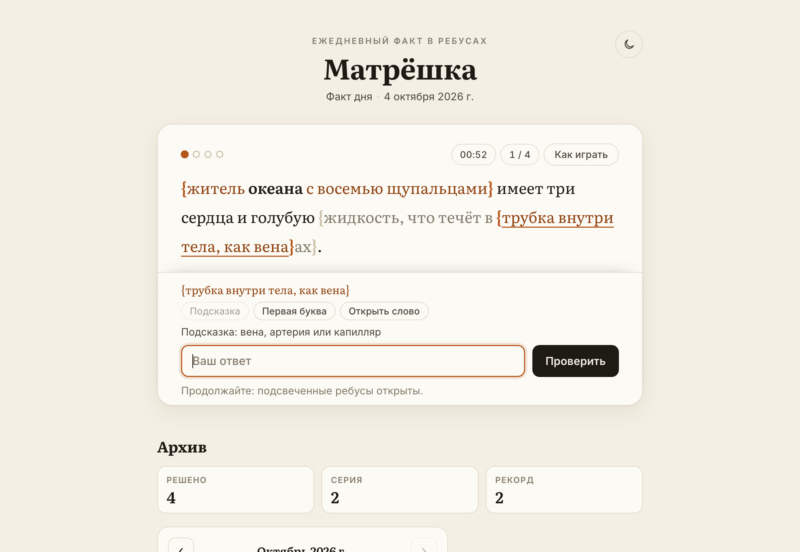
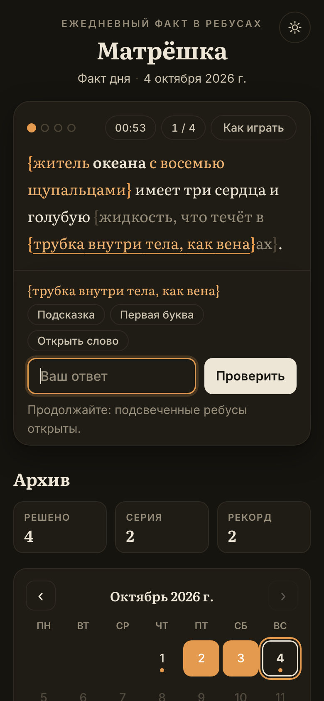
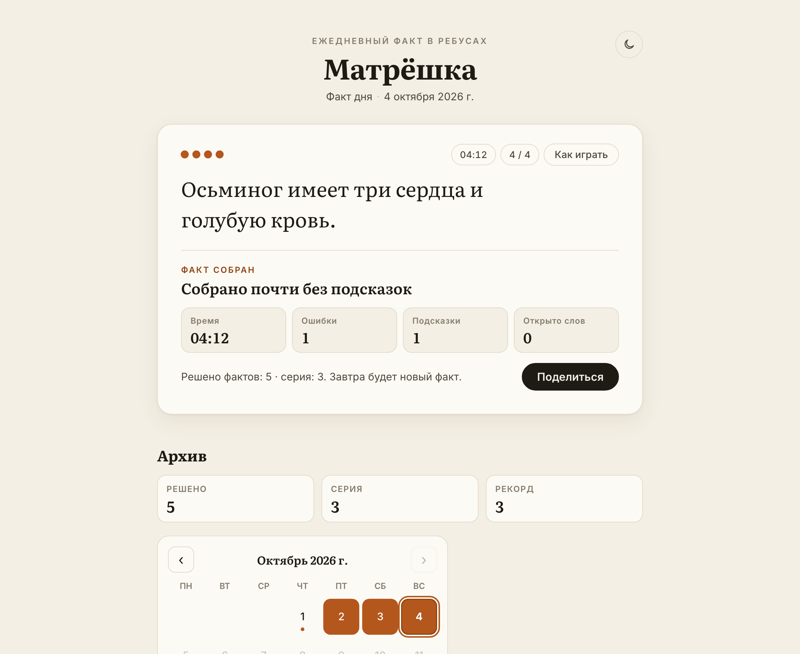
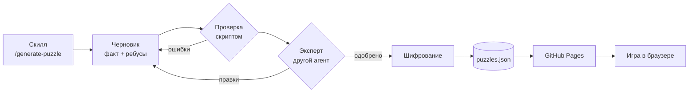

<div align="center">


# Матрёшка

**Ежедневный факт, спрятанный во вложенные ребусы**

Разгадываешь изнутри наружу — слой за слоем, пока факт не соберётся целиком.

[**▶ Играть**](https://nottolstybai.github.io/matryoshka/)

[](https://github.com/nottolstybai/matryoshka/actions/workflows/ci.yml)
[](https://github.com/nottolstybai/matryoshka/actions/workflows/pages.yml)


<picture>
  <source media="(prefers-color-scheme: dark)" srcset="docs/play-dark.png">
  
</picture>

</div>

## Как играть

Часть слов в факте заменена ребусами в фигурных скобках. Ответ — одно слово; окончание уже стоит в тексте рядом со скобкой.

```
Мыши боятся {домашний зверь, который мурлычет}ов.
             └─ кот  →  «Мыши боятся котов.»
```

Ребусы вложены друг в друга, как матрёшки: внешний открывается только после того, как разгаданы все внутренние.

```
{житель {огромный солёный водоём, больше моря}а с восемью щупальцами} имеет три сердца…
         └─ океан  →  {житель океана с восемью щупальцами}
                       └─ осьминог
```

В трудных головоломках сама подсказка собрана из кусочков слов — пока не разгадаешь кусочки, её нельзя даже прочитать:

```
{баня без веника}{щетина над губой}  →  пар + ус  →  «парус»
```

Застрял — нажми на ребус: можно взять дополнительную подсказку, открыть первую букву или слово целиком.

<div align="center">

&nbsp;&nbsp;

</div>

## Что есть

- **Факт дня** — новая головоломка каждый день по дате на устройстве.
- **Архив с календарём** — прошлые дни открыты, будущие закрыты.
- **Подсказки** — дополнительная подсказка, первая буква, открыть слово.
- **Таймер и итог дня** — время, ошибки, подсказки и оценка сборки; результатом можно поделиться без спойлеров.
- **Серия** — сколько дней подряд решено в свой день.
- **Светлая и тёмная тема**, телефон и компьютер.
- **Прогресс** хранится в браузере: день можно бросить и продолжить.

## Как устроено

Сервера нет. Игра — статическая страница на GitHub Pages; головоломки заранее сгенерированы, зашифрованы и лежат в одном JSON-файле.



- **Чистый HTML, CSS и JavaScript** на ES-модулях — без сборки, фреймворков и npm-зависимостей.
- **Движок** разбирает текст со скобками в дерево, следит, какие ребусы доступны, и точечно обновляет страницу: разгаданный ребус сворачивается в слово, соседние слова доезжают на место.
- **Ответов в открытом виде нет.** В `puzzles.json` у каждого ребуса — SHA-256 хеш для проверки ввода и слово, зашифрованное AES-GCM. Шифрует скрипт, расшифровывает браузер; код общий (`web/js/crypto.js`), поэтому они не могут разойтись.
- **При выкладке** к скриптам и стилям дописывается метка версии, чтобы браузер не смешал новые файлы со старыми из кеша.

> [!NOTE]
> Шифрование защищает от случайного подглядывания, а не от взлома: подсказка «открыть слово» работает без ответа игрока, значит, слово может достать и код.

### Структура

```
web/              сайт — то, что выкладывается
  js/             движок: разбор, модель, отрисовка, шифрование, календарь, прогресс
  data/           зашифрованный пул головоломок
tools/            проверка черновиков, шифрование, метка версии, макеты иконок
tests/            тесты (node --test)
docs/             скриншоты для этого файла
puzzles/          открытые головоломки с ответами — только локально, в git не попадают
.claude/skills/   скилл генерации новых головоломок
```

## Разработка

Нужны Node.js 22+ и Python 3 (для локального сервера).

| Команда | Что делает |
|---|---|
| `make dev` | локальный сервер на http://localhost:8000 |
| `make test` | тесты движка, шифрования и инструментов |
| `make check` | проверка синтаксиса |
| `make seal` | зашифровать головоломки из `puzzles/source.json` в пул |
| `make assets` | перерисовать иконки и превью ссылки |
| `make` | список всех команд |

Пуш в `main` запускает тесты и выкладку на GitHub Pages.

## Новые головоломки

Головоломки пишет скилл Claude Code — `/generate-puzzle [число дней]`:

1. выбирает сферу и удивительный, проверяемый факт — от биологии и математики до аниме и видеоигр;
2. прячет 4–6 слов факта в 15–20 вложенных ребусов;
3. прогоняет черновик через `tools/puzzle.mjs`: скобки, склейка слов в факт, ответ не выдан подсказкой, анаграммы сходятся по буквам;
4. отдаёт на экспертизу отдельному агенту, который оценивает правдивость, интересность, честность и сложность — и возвращает на доработку, пока не станет достаточно трудно;
5. шифрует, коммитит и пушит.

Ответы в чат не выводятся: автор играет в свои головоломки сам.
